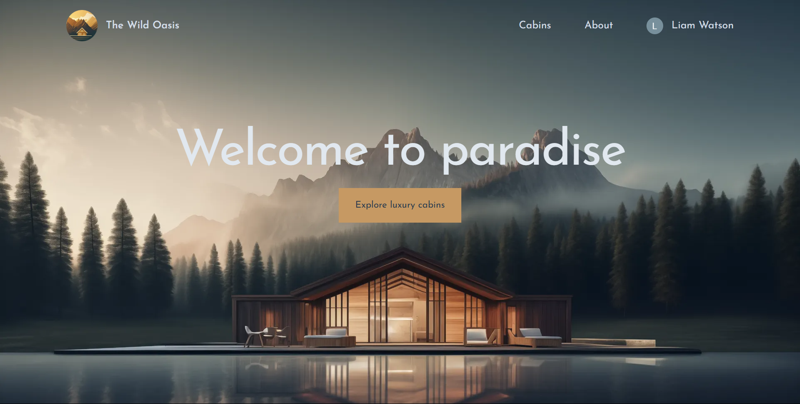

# The Wild Oasis Website

## Description

The Wild Oasis is a holdiay booking website, allowing users to book luxury cabins. It is the client facing side to the Wild Oasis Hotel Dashboard, and works in conjunction - sharing the same supabase database. 

---

## Usage

By going to the Wild Oasis website a user can:

- Sign in using their Google account.
- Browse available cabins and see details and images.
- Book a cabin using an interactive calendar to check availability and select dates.
- Access a user dashboard to view, modify, or cancel existing bookings and manage their profile.

---

## Technologies Used

- Next.js
- Tailwind CSS
- React-day-picker - for the interactive calendar
- Auth.js - for google authentication
- Supabase - for database storage orage

---

## Screenshot

---

## The Website

[Live Demo – Visit The Wild Oasis](https://the-wild-oasis-website-mmpe.vercel.app)

---

## Acknowledgement

This site was built as part of the **Ultimate React Course by Jonas Schmedtmann**.

---

## License

MIT License  
(Please refer to the [LICENSE](./LICENSE))
